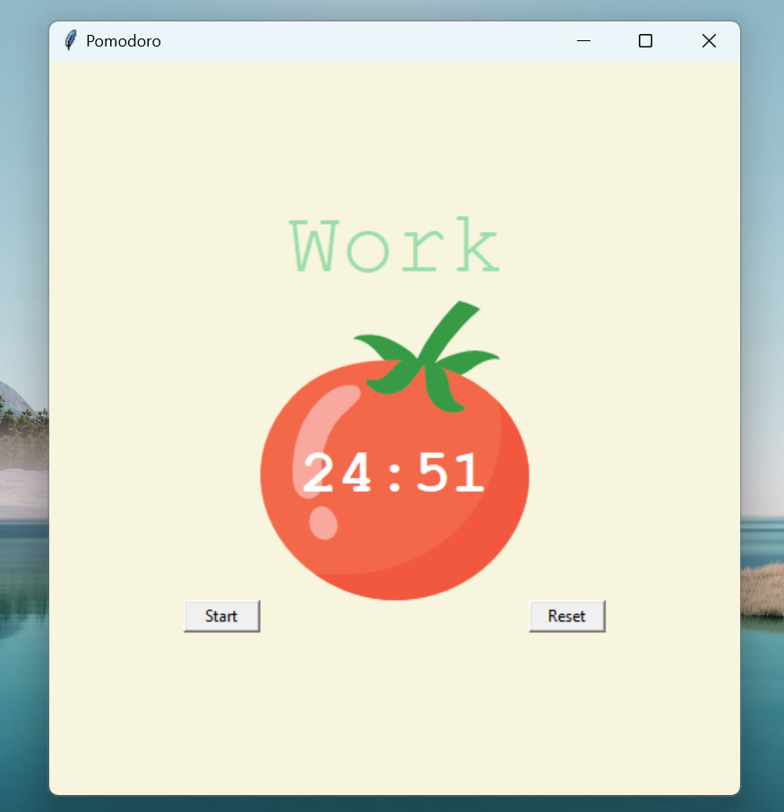
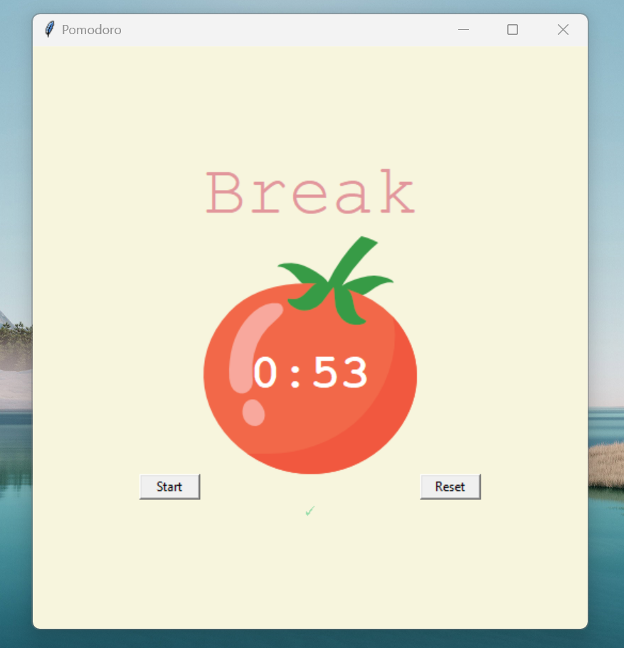

# Pomodoro Timer 🍅⏱️⏳

## Description

The Pomodoro Timer is a productivity tool that helps users manage their time effectively by breaking work into intervals separated by short breaks. This application implements the Pomodoro Technique, allowing users to focus on tasks for a set period and then take short breaks to relax. 

    
    

## Features

- Set custom work and break durations.⏳
- Visual indication of the current timer status (work or break).💼💤
- Display of check marks for completed work sessions.✅
- Reset functionality to restart the timer.🔄
- Simple and intuitive user interface.📲

## Technologies Used

- Python🐍
- Tkinter
- Math module🧮

## How to Use

1. **Download or clone the repository** to your local machine using the following command:\
git clone <repository_url>
2. Ensure you have **Python installed** on your machine.
3.  **Run the `pomodoro_timer.py` file** using Python.
4. **Set Work and Break Durations**\
**Customize the work and break durations** as needed by modifying the constants in the Python script:
- `WORK_MIN`: Duration of the **work session** in minutes.
- `SHORT_BREAK_MIN`: Duration of the **short break** in minutes.
- `LONG_BREAK_MIN`: Duration of the **long break** in minutes.
5. **Start the Timer**\
  Click the "Start" button in the application window to begin the timer countdown. 
4. **Reset the Timer**\
  To restart the timer, click the "Reset" button. This will **cancel the current session and reset the timer to its initial state**.
5. **View Check Marks**\
  As you complete work sessions, **check marks** will appear below the timer to indicate **completed sessions**.
6. **Customization and Contribution**\
   Feel free to customize the application further or contribute to the project by adding new features, improving existing code, or fixing bugs. Fork the repository, make your changes, and submit a pull request to the original repository for review.
7. **Enjoy Productivity**\
  Utilize the Pomodoro Timer to enhance your productivity and time management skills by staying focused during work sessions and taking regular breaks.
8. **Provide Feedback**\
  If you have any feedback, suggestions, or issues with the project, don't hesitate to open an issue on GitHub. Your input is valuable for improving the application and making it more user-friendly.

That's it! Follow these steps to make the most out of the Pomodoro Timer project on GitHub. Happy coding and stay productive!❤️🧠
  
## Credits

This project was created with ❤️ by [Iwona](https://www.linkedin.com/in/iwona-rafa%C5%82owska-762626212/) in Gdańsk🌊.

## License

This project is licensed under the [MIT License](LICENSE).
